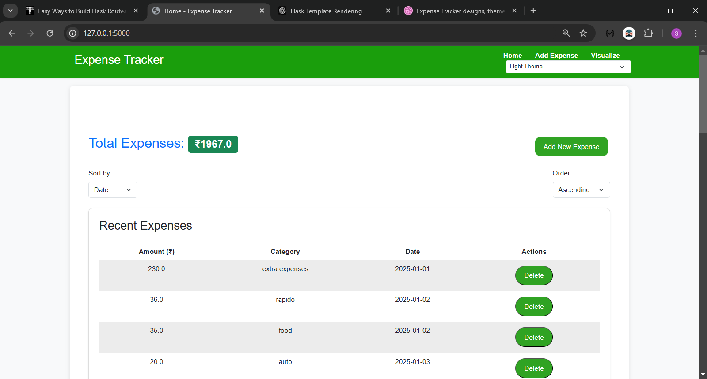
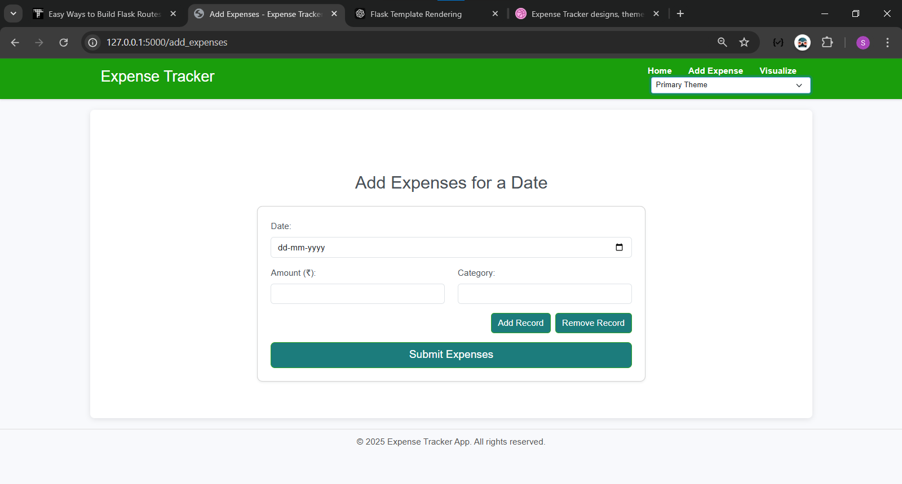
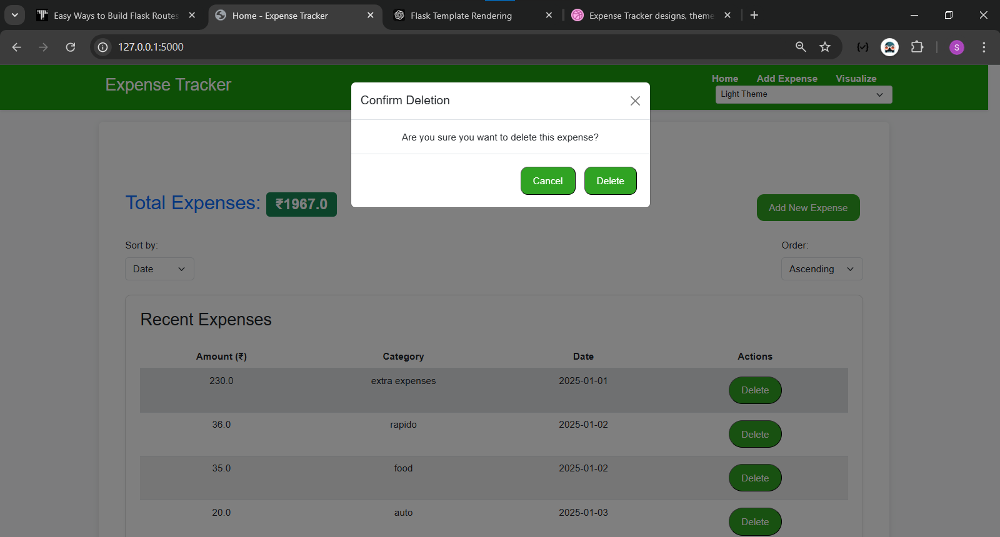
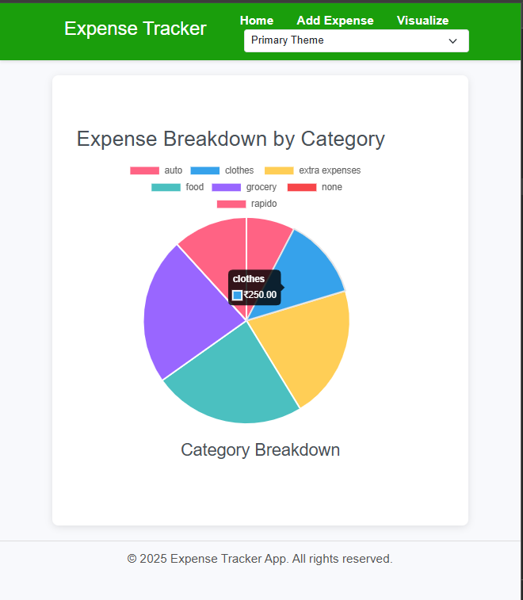

# Expense Tracker

An intuitive web-based **Expense Tracker** that allows users to manage and track their personal expenses. The app lets users add, visualize, and delete expenses, providing an easy way to keep track of spending over time. Built using Flask for the backend and a simple, responsive UI.

## Features

- **Add Expenses**: Users can add expenses with an amount, category, and date.
- **View Expenses**: The app displays a table of all expenses with their details.
- **Delete Expenses**: Users can delete unwanted expenses.
- **Total Expense Calculation**: The app calculates and displays the total amount of expenses added.
- **Responsive UI**: Modern, user-friendly interface built with HTML, CSS, and JavaScript.
- **Persistent Data Storage**: Expense data is saved in a SQLite database.

## Screenshots

### 1. Home Page


*Displays total expenses and a list of all expenses.*

### 2. Add Expense Page


*Form for adding new expenses with fields for amount, category, and date.*

### 3. Delete Expense Functionality


*Each expense entry has a delete button for quick removal.*

### 4. Responsive Design


*View on mobile and desktop screens.*

---

## Installation

1. **Clone the repository:**

   ```bash
   git clone https://github.com/SaumyaMishra210/expense_tracker.git
   cd expense_tracker
